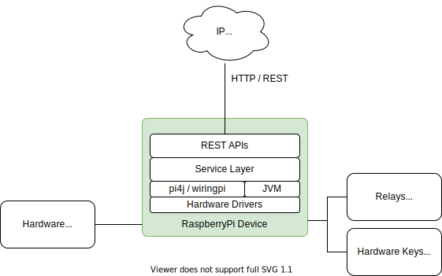

# RPi Power Controller
This project describes how to build AC power switching device controlled remotely over __HTTP / REST__ interface.
The device is based on [RaspberryPI](https://www.raspberrypi.org/) and compatible hardware peripherals.

__Key features__:
* __4 AC power ports__ - controlled remotely via HTTP / REST (ON | OFF).
* __sensor data__ - measures temperature, relative humidity and atmospheric pressure.
* __task execution__ - execute one-at-a-time tasks based on pre-defined job (switching sequence) 
* __simple security__ - client-id / client-secret, basic access authentication.

WIP features:
* __4 keys to trigger jobs__ - trigger pre-defined jobs using 4 hardware keys / buttons.
* __scheduled jobs__ - task scheduling based on pre-defined job sequences.

## Hardware Architecture


Detailed [hardware bill of material](docs/hardware-bom.md).  

## Software Architecture


* Tiny software stack, 32 MB of heap space to run.
* Java 8 and Java 11 compatible.
* [undertow.io](http://undertow.io/) as web server.
* [com.fasterxml.jackson](https://github.com/FasterXML/jackson) for JSON processing.
* [Raspbian Lite](https://www.raspberrypi.org/downloads/raspbian/), [WiringPi](http://wiringpi.com/), [pi4j](https://pi4j.com/1.2/index.html)
* No frameworks, plain java.

### Configuration
__rpi-powercontroller__ requires external [JSON configuration](src/main/resources/configuration.json) file in order to load initial configuration. 
Please check [configuration manual](docs/rpi-powercontroller-configuration.md) for details.

### Jobs, Tasks and Actions
__rpi-powercontroller__ is capable of running autonomous tasks. Please check [documentation](docs/jobs-tasks-and-actions.md) for details.

### REST APIs and Endpoints
* [Complete Postman collection](docs/rpi-powercontroller.postman_collection.json)
* Get system information like device id, uptime, ...  
  __GET__ ``/system/info``
* Get sensor data (temperature, rel. humidity, atm. pressure)  
  __GET__ ``/system/measurements``
* Get post states (ON | OFF) and port types (INPUT | OUTPUT)  
  __GET__ ``/system/state``
* Set OUTPUT port state (ON=true | OFF=false)  
  __PUT__ ``/system/port``  
  ``
  { "port": 0, "state": true }
  ``
* Get available pre-configured jobs.  
  __GET__ ``/system/jobs``
* Get task queue (waiting, in-progress, finished) tasks.  
  __GET__ ``/system/tasks``
* Submit job to task execution - returns task-id of submitted job.  
  __PUT__ ``/system/tasks/submit``  
  ``
  { "id": "job-001" }
  ``
* Cancel task execution by task-id.  
  __PUT__ ``/system/tasks/cancel``  
  ``
  { "id": "task-001" }
  ``
* Stop all running tasks and execute selected 'killAllTaskId'.  
  __PUT__ ``/system/tasks/cancel/all``   
  
#### REST Security  
All REST endpoint require [HTTP basic authorization](https://en.wikipedia.org/wiki/Basic_access_authentication) header to be used, valid __client-id / client-secret__.
Check configuration section.

``
curl -u <client-id>:<client-secret> http://<server>:<port>/uri
``
  
## Build & Test on dev PC
RPi Power Controller is designed to be build and tested on PC. In this case  
``itx.rpi.powercontroller.services.impl.RPiSimulatedServiceImpl`` is used instead of real RPi hardware.
### Development Environment
* [OpenJDK 8 or 11](https://adoptopenjdk.net/).
* [Gradle 6.0](https://gradle.org/install/) or later.
```
# build and test
gradle clean build test installDist distZip

# start RPi Power Controller in simulated mode
./build/install/rpi-powercontroller/bin/rpi-powercontroller
```

## Install and Run on Raspberry PI
1. Install [Raspbian Buster Lite](https://downloads.raspberrypi.org/raspbian_lite_latest)  
2. Enable I2C bus ``sudo raspi-config`` 
3. Install I2C tools and [wiringpi](http://wiringpi.com/download-and-install/)  
   ```
   sudo apt-get install -y python-smbus i2c-tools
   sudo apt-get install wiringpi
   ```
4. Check gpio and connected I2C devices
   ```
   gpio -v
   i2cdetect -y 1
   ```
5. Install java, JRE 8 is enough.
   * Raspberry PI zero [32bit Oracle JRE 8 for ARM](https://www.oracle.com/java/technologies/javase-jdk8-downloads.html)
   * Raspberry 3 or later ``apt install default-jdk``
6. Create installation directory on target RPi device.
   ```
   mkdir -p /opt/rpi-powercontroller
   ```   
7. Build distribution zip and copy the zip and init scripts to target RPi device.
   ```
   gradle clean build test installDist distZip
   scp build/distributions/rpi-powercontroller-1.0.0.zip pi@<ip-address>:/opt/rpi-powercontroller/
   scp -r scripts/* pi@<ip-address>:/opt/rpi-powercontroller/
   scp src/main/resources/configuration.json pi@<ip-address>:/opt/rpi-powercontroller/
   ```
8. Finish installation on target RPi device.
   ```
   cd /opt/rpi-powercontroller
   unzip rpi-powercontroller-1.0.0.zip
   chmod 755 controller-start.sh
   chmod 755 controller-stop.sh
   sudo cp rpi-powercontroller.service /etc/systemd/system/
   sudo chown root:root /etc/systemd/system/rpi-powercontroller.service
   sudo systemctl daemon-reload
   sudo systemctl enable rpi-powercontroller
   ```
   Edit JSON configuration file as required, follow configuration manual. 
9. Start, stop, get status of rpi-powercontroller service.
   ```
   sudo systemctl start rpi-powercontroller
   sudo systemctl stop rpi-powercontroller
   sudo systemctl status rpi-powercontroller
   ```

*Enjoy !*

