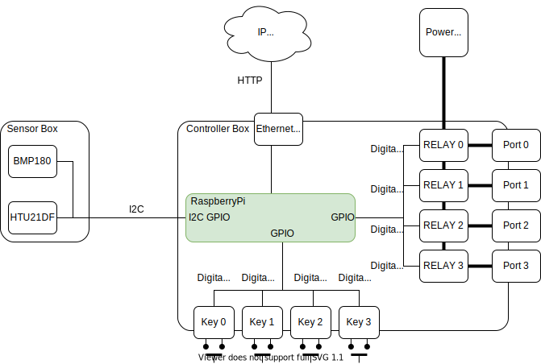

# RPi Power Controller
This project describes AC power switching device controlled over HTTP / REST base on 
RaspberryPI hardware and compatible hardware peripherals.

## Hardware Architecture


Detailed [hardware bill of material](docs/hardware-bom.md).  

## Software Architecture


* Tiny software stack, 32 MB of heap space to run.
* Java 8 and Java 11 compatible.
* [undertow.io](http://undertow.io/) as web server.
* [com.fasterxml.jackson](https://github.com/FasterXML/jackson) for JSON processing.
* No frameworks, plain java.

## REST APIs and Endpoints
* [Complete Postman collection](docs/rpi-powercontroller.postman_collection.json)
* __GET__ ``/system/info``
* __GET__ ``/system/measurements``
* __GET__ ``/system/state``
* __PUT__ ``/system/port``  
  ``
  { "port": 0, "state": true }
  ``
* __GET__ ``/system/jobs``
* __GET__ ``/system/tasks``
* __PUT__ ``/system/tasks/submit``  
  ``
  { "id": "job-001" }
  ``
* __PUT__ ``/system/tasks/cancel``  
  ``
  { "id": "task-001" }
  ``
## Build & Run
```
gradle clean build test installDist distZip
./build/install/rpi-powercontroller/bin/rpi-powercontroller
``` 

## Raspberry PI installation
1. Install [Raspbian Buster Lite](https://downloads.raspberrypi.org/raspbian_lite_latest)  
2. Enable I2C bus ``sudo raspi-config`` 
3. Install i2c tools and [wiringpi](http://wiringpi.com/download-and-install/)  
   ``
   sudo apt-get install -y python-smbus i2c-tools
   sudo apt-get install wiringpi
   `` 
4. Check gpio and connected I2C devices
   ```
   gpio -v
   i2cdetect -y 1
   ```
5. Install java
   * Raspberry PI zero [32bit Oracle JRE 8 for ARM](https://www.oracle.com/java/technologies/javase-jdk8-downloads.html)
   * Raspberry 3 or later ``apt install default-jdk``
6. Create installation directory on target RPi device.
   ```
   mkdir -p /opt/rpi-powercontroller
   ```   
7. Build distribution zip and copy the zip and init scripts to target RPi device.
   ```
   scp build/distributions/rpi-powercontroller-1.0.0.zip pi@<ip-address>:/opt/rpi-powercontroller/
   scp -r scripts/* pi@<ip-address>:/opt/rpi-powercontroller/
   ```
8. Finish installation on target RPi device.
   ```
   cd /opt/rpi-powercontroller
   unzip rpi-powercontroller-1.0.0.zip
   chmod 755 controller-start.sh
   chmod 755 controller-stop.sh
   sudo cp rpi-powercontroller.service /etc/systemd/system/
   sudo chown root:root /etc/systemd/system/rpi-powercontroller.service
   sudo systemctl daemon-reload
   sudo systemctl enable rpi-powercontroller
   ```
9. Start, stop, get status of rpi-powercontroller service.
   ```
   sudo systemctl start rpi-powercontroller
   sudo systemctl stop rpi-powercontroller
   sudo systemctl status rpi-powercontroller
   ```

